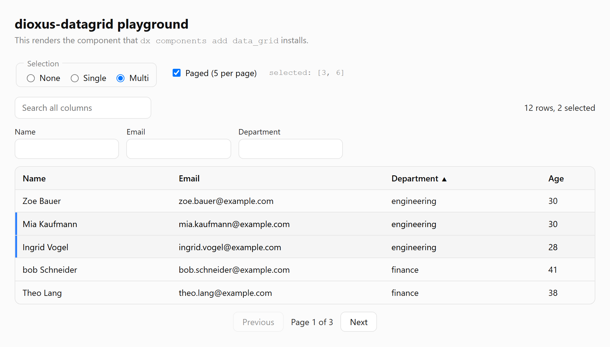

# dioxus-datagrid

A typed, accessible data grid for **Dioxus 0.7**: sorting, filtering, search, paging, selection,
resizable and hideable columns, virtualization and full keyboard navigation. It follows the WAI-ARIA data grid pattern and runs on web, desktop
and mobile.



[](https://crates.io/crates/dioxus-datagrid)
[](https://docs.rs/dioxus-datagrid)

## How it is put together

The logic is versioned in crates, so fixes reach everyone. The styled shell is copied into your
project by `dx components add` and is yours to change from then on.

| | |
|---|---|
| [`datagrid-core`](crates/datagrid-core) | Sorting, filtering, paging, selection, virtualization math. Pure Rust, no UI framework. |
| [`dioxus-datagrid`](crates/dioxus-datagrid) | The `use_grid` hook and unstyled primitives implementing the ARIA grid pattern. No `web-sys`. |
| [`registry/data_grid`](registry/data_grid) | The styled component that `dx components add data_grid` installs. |
| [`registry/data_grid_editor`](registry/data_grid_editor) | Editing for it: cells, rows, a form dialog or batches, installed next to `data_grid`. |

## Installation

Point the Dioxus CLI at this repository as a component registry. Either per command:

```bash
dx components add data_grid --git https://github.com/dioxus-datagrid/dioxus-datagrid
```

or once, in your project's `Dioxus.toml`, after which a plain `dx components add data_grid` uses it:

```toml
[components]
registry = { git = "https://github.com/dioxus-datagrid/dioxus-datagrid" }
```

The command copies the component into `src/components/data_grid/`, adds `dioxus-datagrid` to your
`Cargo.toml` and copies the dx-components theme into `assets/`. If this is your first component,
add `mod components;` to `main.rs`.

dx keeps a clone of the registry and does not refresh it on its own. To pick up a newer version of
the component, refresh the clone first:

```bash
dx components update --git https://github.com/dioxus-datagrid/dioxus-datagrid
```

## Usage

```rust
use dioxus::prelude::*;
use dioxus_datagrid::{CellFormat, Column, GridRow, SelectionMode};

use crate::components::data_grid::DataGrid;

#[derive(Clone, PartialEq)]
struct User {
    id: u32,
    name: String,
    salary: f64,
}

// A stable identity, so selection survives sorting and paging.
impl GridRow for User {
    type Key = u32;
    fn key(&self) -> u32 {
        self.id
    }
}

#[component]
fn Users() -> Element {
    let users = use_signal(load_users);

    let columns = use_hook(|| {
        vec![
            Column::new("name", "Name")
                .cell(|user: &User| rsx! { "{user.name}" })
                .sort_by_text(|user: &User| user.name.as_str())
                .filter_by(|user: &User| user.name.clone()),
            // No `.cell()`: the grid shows the value, formatted.
            Column::new("salary", "Salary")
                .value_of(|user: &User| user.salary)
                .format(CellFormat::currency("€", 2)),
        ]
    });

    rsx! {
        DataGrid {
            data: users,
            columns,
            page_size: 25,
            selection: SelectionMode::Multi,
            on_selection_change: move |keys: Vec<u32>| { /* ... */ },
        }
    }
}
```

For large data sets, set `row_height` and `height` instead of `page_size`: only the rows in view
are rendered, while the scrollbar, keyboard navigation and `aria-rowcount` still cover every row.
[`examples/virtualized`](examples/virtualized) shows 100,000 rows built directly on the primitives.

Columns can be resized by dragging a header's edge, and `column_picker` adds a menu to show and
hide them. With the `serde` feature the whole grid state — sort, filters, page, widths, hidden
columns — round trips through `initial_state` and `on_state_change`.

`column_filters` adds a filter bar that understands `>100`, `!=Berlin` and `10..20`, and
`filter_menu` a menu per column: conditions joined by *and* or *or*, or a list of values with
counts to tick. A remote grid sends both to the server as part of the `GridQuery`;
[`examples/fullstack`](examples/fullstack) turns them into SQL.

Numbers, currencies, percentages and dates (`chrono` feature) are formatted per column, and every
text the grid writes comes from a `GridLocale`: English by default, German included, as in
`DataGrid { locale: GridLocale::german(), .. }`.

The installed [`docs.md`](registry/data_grid/docs.md) lists every prop and column option.

## Editing

`dx components add data_grid_editor` adds editing. Mark columns editable with a setter of the
field's own type, and put a `DataGridEditor` inside the `DataGrid`:

```rust
Column::new("age", "Age")
    .value_of(|user: &User| user.age)
    // "abc" or "-3" is refused at the cell before the setter runs.
    .editable(|user: &mut User, age: u32| user.age = age),
```

```rust
DataGrid { data: users, columns,
    DataGridEditor {
        mode: EditMode::Row,
        on_save: move |save: Save<User>| async move {
            if let Err(error) = api::update(save.row()).await {
                save.fail(error.to_string());
            }
        },
    }
}
```

The grid never writes your data: it hands the edited row to the callback and shows it while the
save runs. If the save fails, the old value comes back with the message. Cells, whole rows, a form
dialog and batches are supported, with adding, deleting and validation at the cell;
[`docs.md`](registry/data_grid_editor/docs.md) has the details.

## Grouping and aggregates

Give columns aggregates, and `data_grid` shows them under the grid:

```rust
Column::new("total", "Total")
    .value_of(|order: &Order| order.total)
    .aggregate(Aggregate::Sum)
    .aggregate(Aggregate::Average),
```

`dx components add data_grid_group_panel` adds a panel to group rows by: drag a column header onto
it, or pick a column from its list.

```rust
DataGrid { data: orders, columns,
    DataGridGroupPanel::<Order> {}
}
```

Groups expand and collapse with a click or the arrow keys, each group shows its aggregates, and a
grouped grid is a WAI-ARIA treegrid. Grouping works with paging, with 100,000 virtualized rows,
and on the server: see [`docs.md`](registry/data_grid_group_panel/docs.md).

## Headless usage

If you want your own markup, skip the registry component and compose the primitives. They render
the roles, ARIA attributes and keyboard handling, and nothing else.

```rust
use dioxus_datagrid::primitives::{GridBody, GridHeader, GridPagination, GridRoot, GridSearch};
use dioxus_datagrid::{GridOptions, SelectionMode, use_grid};

let grid = use_grid(users, columns, GridOptions::paged(25).selection(SelectionMode::Multi));

rsx! {
    GridSearch { grid, class: "my-search" }
    GridRoot { grid, class: "my-grid",
        GridHeader { grid, resizable: true }
        GridBody { grid }
    }
    GridPagination { grid }
}
```

`GridHandle` is `Copy` and exposes the state directly — `toggle_sort`, `set_filter`, `set_search`,
`set_page`, `set_column_hidden`, `set_column_width`, `select`, `toggle_select`, `clear_selection`,
`state` / `set_state`, and for editing `set_editing`, `start_edit`, `commit_edit`, `request_delete`
and `save_changes` — for building controls of your own. The editing primitives (`GridEditToolbar`,
`GridEditDialog`, `GridDeleteConfirm`, `GridEditStatus`) work the same way.

## Server-side data

For data too large to send to the client, `use_grid_remote` asks a `DataSource` for one page at a
time. Every sort, filter, search or page change becomes a `GridQuery`; typing is debounced, and a
slow answer to an old query never overwrites a newer one.

```rust
impl DataSource<User> for Api {
    type Error = String;

    async fn fetch(&self, query: GridQuery) -> Result<Page<User>, String> {
        // query.sort, query.column_filters, query.filters, query.search, query.page, …
        todo!("ask your server")
    }
}

let grid = use_grid_remote(Api, columns, GridOptions::paged(50));

rsx! {
    GridStatus { grid }
    GridRoot { grid,
        GridHeader { grid }
        GridBody { grid }
    }
    GridPagination { grid }
}
```

The same primitives render it. [`examples/server`](examples/server) runs against a simulated server
with adjustable latency; [`examples/fullstack`](examples/fullstack) queries SQLite through a Dioxus
server function and shows how a `GridQuery` becomes SQL.

Column ids in a query come from the client. Map them to SQL through a fixed list of allowed columns
and bind all filter text as parameters — never build SQL from the ids or text directly.

Grouped queries carry `group_by` and the aggregates wanted. A server with its rows in memory answers
with `Page::from_view(&compute_view(&rows, &columns, &query.state()), &rows)`. A SQL server counts
the groups with one `GROUP BY` per level and lets `GroupedPage::plan` work out which group headers,
footers and row ranges the page shows; `examples/fullstack` does exactly that.

## Accessibility

The grid is a single tab stop with a roving tabindex. Arrow keys move between cells, `Home`/`End`
within a row, `Ctrl+Home`/`Ctrl+End` to the corners. `Enter` on a header sorts, `Shift+Enter` adds
a sort column. `Space` selects a row, `Shift+Space` and `Shift+Arrow` extend the selection.
`aria-rowcount` and `aria-rowindex` stay correct across pages. On a header, `Alt+ArrowLeft` and
`Alt+ArrowRight` resize the column.

[`docs/ACCESSIBILITY.md`](docs/ACCESSIBILITY.md) documents exactly what is rendered.

## Development

```bash
cargo fmt --all
cargo clippy --workspace --all-targets --all-features -- -D warnings
cargo test --workspace --all-features
```

The playground renders the registry component with controls for every mode:

```bash
dx serve --web --package playground
```

It carries a copy of `registry/data_grid`. After changing the component, refresh the copy — CI
fails if the two differ:

```bash
bash scripts/sync-playground-component.sh
```

End-to-end tests run against the playground; with it already serving on port 8080 they reuse it:

```bash
cd tests/e2e && npm ci && npx playwright test
```

The registry smoke test runs `dx components add` against a fresh project and compiles it:

```bash
bash scripts/registry-smoke.sh
```

Planning and design records are in German: [`PLAN.md`](PLAN.md), [`docs/DECISIONS.md`](docs/DECISIONS.md),
[`docs/VERIFICATION.md`](docs/VERIFICATION.md).

## License

Licensed under either of [Apache License, Version 2.0](LICENSE-APACHE) or [MIT license](LICENSE-MIT)
at your option.

The bundled `dx-components-theme.css` is taken from
[DioxusLabs/components](https://github.com/DioxusLabs/components), under the same terms.
